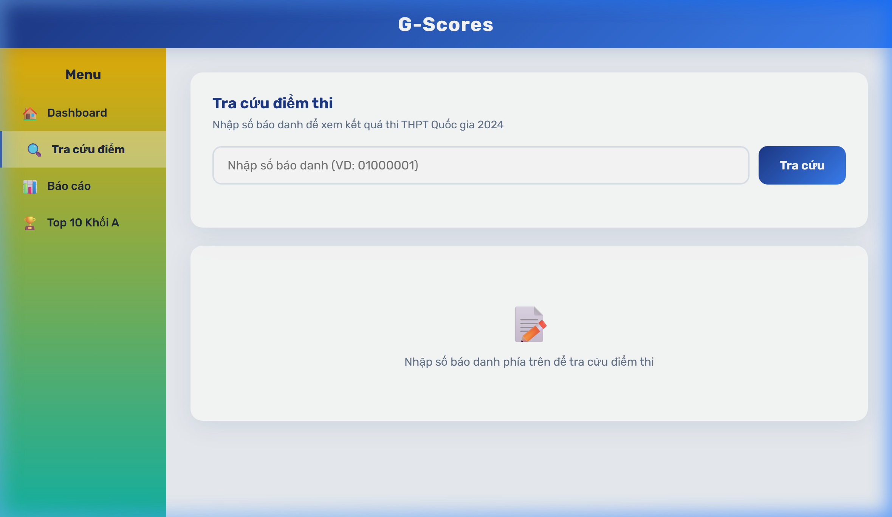
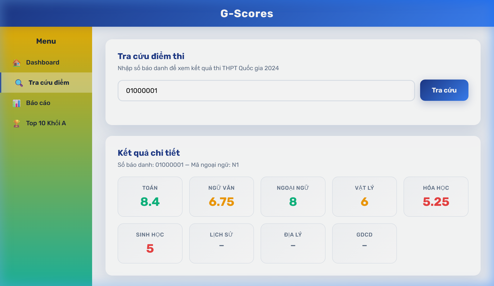
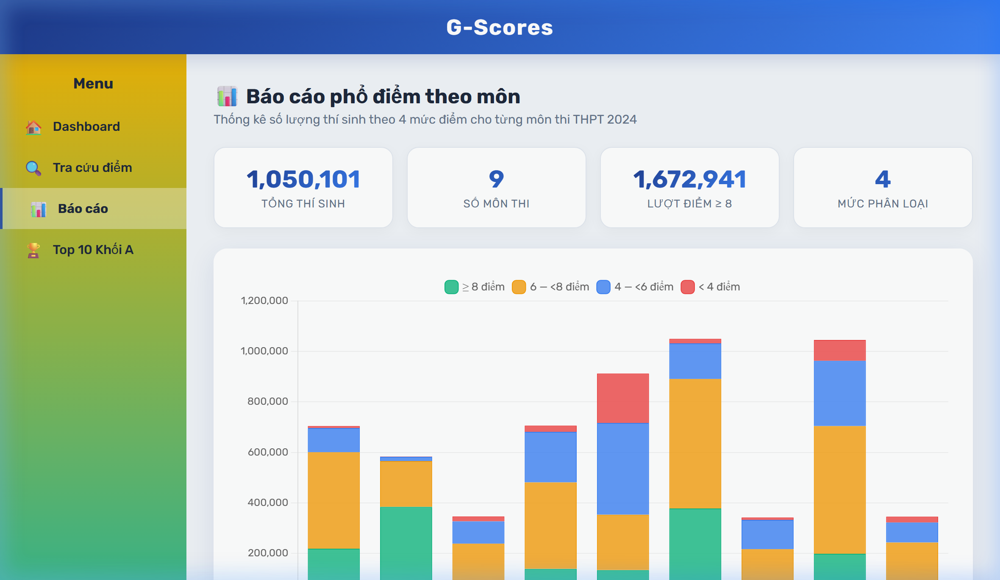
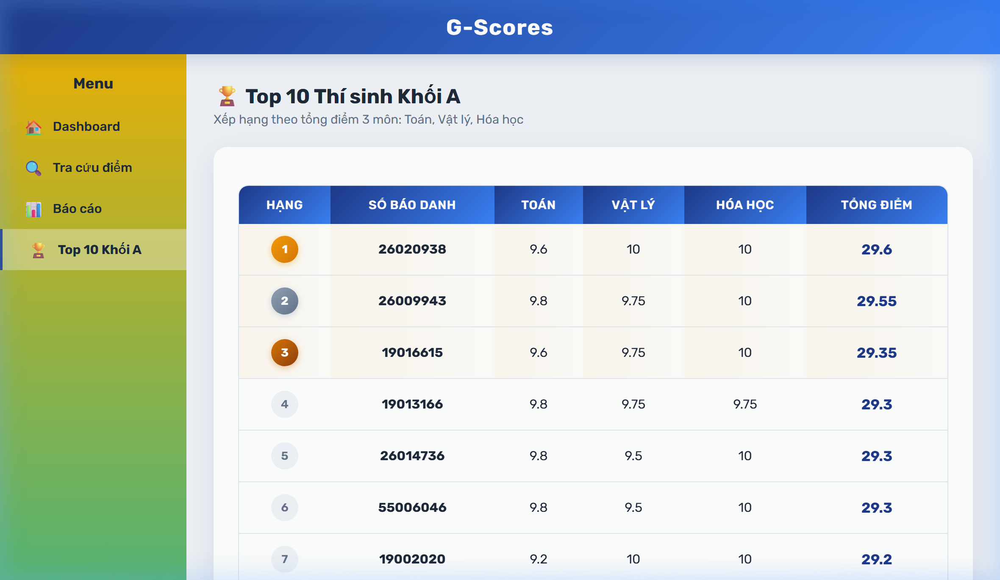

# G-Scores — Tra cứu Điểm Thi THPT 2024

> 🌐 **Demo**: [https://gscores.dongnama.app](https://gscores.dongnama.app)

Ứng dụng web tra cứu điểm thi THPT Quốc gia 2024, thống kê phổ điểm theo môn, và xếp hạng top 10 thí sinh khối A.

## 📸 Screenshots

### Trang tra cứu điểm


### Kết quả tra cứu


### Báo cáo phổ điểm


### Top 10 khối A


---

## ✨ Tính năng

### Must have ✅
- **Import CSV → Database**: Script `init_db.py` chuyển ~1 triệu bản ghi từ CSV vào SQLite qua ORM (Flask-SQLAlchemy)
- **Tra cứu điểm theo SBD**: Nhập số báo danh → hiển thị điểm chi tiết tất cả 9 môn dạng score card
- **Báo cáo phổ điểm**: Biểu đồ stacked bar (Chart.js) thống kê 4 mức (≥8, 6-<8, 4-<6, <4) theo từng môn
- **Top 10 khối A**: Bảng xếp hạng Toán-Lý-Hóa với rank badges (gold/silver/bronze)
- **OOP Programming**: Class `SubjectManager` quản lý toàn bộ logic môn học
- **Form validation**: Client-side + server-side validation cho SBD

### Nice to have ✅
- **Responsive design**: Hỗ trợ Desktop, Tablet, Mobile (sidebar collapse + hamburger menu)
- **Docker**: Dockerfile + docker-compose.yml
- **Deploy**: Production deployment tại [https://gscores.dongnama.app](https://gscores.dongnama.app)

## 🛠 Tech Stack

| Layer | Technology |
|-------|-----------|
| Backend | Flask 3.1 + Flask-SQLAlchemy |
| Database | SQLite |
| Frontend | HTML/CSS + Vanilla JS + Chart.js 4 |
| Font | Rubik (Google Fonts) |
| Production | Gunicorn + Docker |
| Deploy | Docker Compose + Cloudflare Tunnel |

## 📁 Cấu trúc

```
├── app.py              # Flask app factory + routes (page & API)
├── models.py           # ORM model StudentScore + OOP class SubjectManager
├── init_db.py          # Database seed script (batch insert ~1M rows)
├── wsgi.py             # WSGI entry point cho Gunicorn
├── deploy.sh           # One-command deploy script
├── requirements.txt    # Python dependencies
├── Dockerfile          # Docker image
├── docker-compose.yml  # Docker Compose config
├── templates/
│   ├── base.html       # Base layout (header + sidebar + content)
│   ├── index.html      # Trang tra cứu điểm
│   ├── report.html     # Trang báo cáo phổ điểm (chart)
│   └── top10.html      # Trang top 10 khối A
├── static/
│   └── style.css       # Design system (glassmorphism, responsive)
└── screenshots/        # Screenshots cho README
```

## 🚀 Chạy Local

### 1) Tạo môi trường và cài dependencies

```bash
python -m venv .venv
source .venv/bin/activate   # Linux/Mac
# .venv\Scripts\activate    # Windows
pip install -r requirements.txt
```

### 2) Khởi tạo database + seed data

```bash
python init_db.py
```

> ⏳ Quá trình import ~1 triệu bản ghi mất khoảng 30-60 giây.

### 3) Chạy ứng dụng

```bash
python app.py
```

Mở trình duyệt tại: `http://127.0.0.1:5000`

## 🐳 Chạy với Docker

```bash
# Build và chạy
docker compose up --build -d

# Hoặc dùng script deploy
./deploy.sh
```

Mở trình duyệt tại: `http://localhost:5000`

## 📡 API Endpoints

| Method | Endpoint | Mô tả |
|--------|----------|-------|
| `GET` | `/` | Trang tra cứu điểm |
| `GET` | `/report` | Trang báo cáo phổ điểm |
| `GET` | `/top10-group-a` | Trang top 10 khối A |
| `GET` | `/api/lookup?sbd=<sbd>` | API tra cứu điểm theo SBD |
| `GET` | `/api/report` | API dữ liệu phổ điểm (JSON) |
| `GET` | `/api/top10` | API top 10 khối A (JSON) |

## ✅ Validation

- `sbd` bắt buộc nhập
- `sbd` chỉ chấp nhận ký tự số (client + server validation)
- Không tìm thấy → trả về lỗi 404 với message rõ ràng
- UI hiển thị error message inline (không alert)

## 📝 Ghi chú

- Điểm trống trong CSV → `NULL` trong database → hiển thị "—" trên UI
- SQL-level aggregation cho report (không load toàn bộ 1M rows vào memory)
- SQL ORDER BY + LIMIT cho top 10 (thay vì Python sort)
- Batch insert 5000 records/lần khi seed database

## 👤 Author

Built for [Golden Owl](https://goldenowl.asia) Web Developer Intern Assignment
